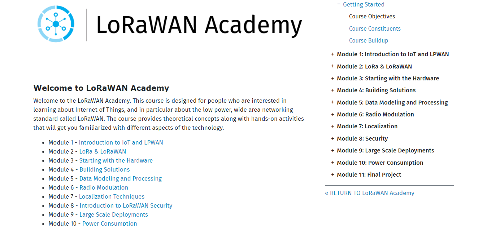
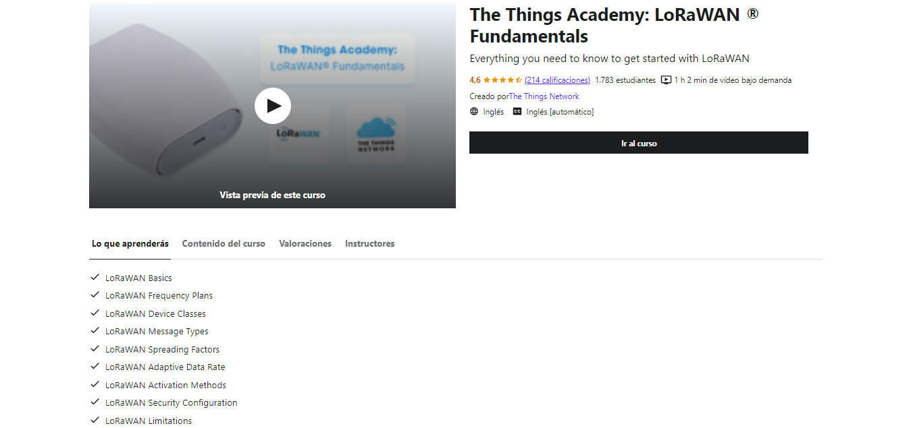
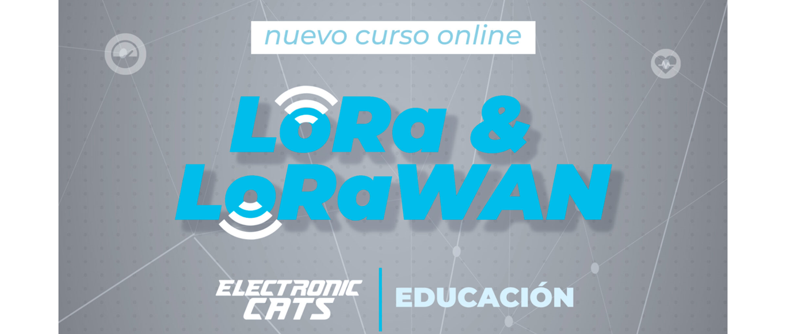
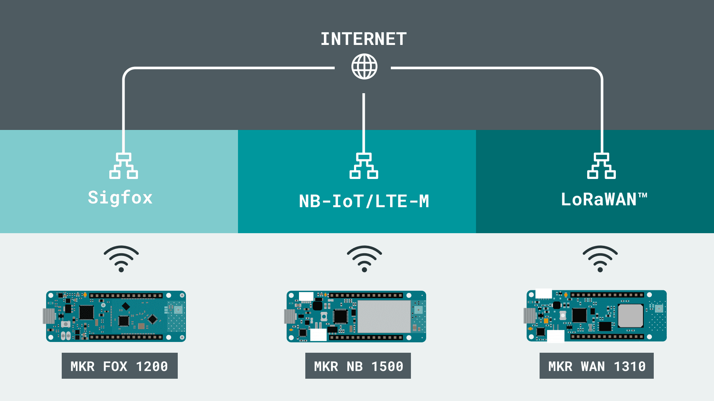
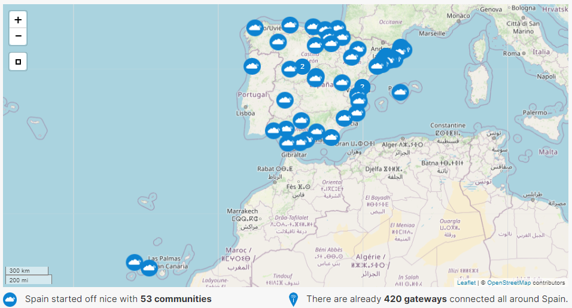

# Recursos de aprendizaje sobre LoRa/LoRaWAN e Internet de las Cosas en general
Este repositorio pretende listar todos aquellos recursos que vaya encontrando con los que aprender y estar al tanto sobre LoRa/LoRaWAN e Internet de las Cosas en general.

## 📚 Cursos sobre LoRa / LoRaWAN

- 🇬🇧 [LoRaWAN Academy](https://lora-developers.semtech.com/learn/lorawan-academy): sin duda alguna, el curso más completo, gratuito (sólo necesitas crear una cuenta) y extenso que encontrarás sobre LoRa/LoRaWAN (creado por Semtech, la empresa que tiene la patente sobre la modulación LoRa®). Además, va mucho más allá, contando con módulos en los que aprender sobre parámetros de antenas, modulaciones, consumo de potencia, etc.



- 🇬🇧 [The Things Academy - LoRaWAN Fundamentals](https://www.udemy.com/course/lorawan-fundamentals/): curso básico sobre LoRa/LoRaWAN (creado por [The Things Network](https://www.thethingsnetwork.org/)) y con el que aprendarás a crear tus propias aplicaciones basadas en redes LPWAN, utilizando la red global The Things Network.



- 🇪🇸 [Curso Online - Protocolo de Comunicación LoRa y LoRaWAN](https://electroniccats.com/store/lora-y-lorawan): curso **en español** para conocer el protocolo de comunicación Lora y LoraWAN. Aprenderás desde los conceptos básicos hasta la realización de prácticas y un proyecto final que te ayudará a comprender mejor este interesante campo de comunicaciones. Se incluye un Kit que contiene la placa BastWAN.



- 🇬🇧 [Arduino: LPWAN (Low Power Wide Area Networks)](https://docs.arduino.cc/learn/communication/low-power-wide-area-networks-101): aprende los fundamentos de las redes de área amplia y bajo consumo (LPWAN) y qué hardware Arduino se puede conectar a ellas.



## 🎞️ Vídeos
- 🇬🇧 Lista de reproducción sobre LoRa/LoRaWAN de [Mobilefish.com](https://www.youtube.com/watch?v=cUhAyyzlv2o&list=PLmL13yqb6OxdeOi97EvI8QeO8o-PqeQ0g) creada por [Robert Lie](https://twitter.com/mobilefish]) 
- 🇬🇧 [LoRa Crash Course](https://youtu.be/T3dGLqZrjIQ) de [Thomas Telkamp](https://twitter.com/telkamp)
- 🇬🇧 [LoRaWAN Crash Course](https://youtu.be/KFswTNjynEI) de [Gonzalo Casas](https://twitter.com/gnz)
- 🇬🇧 [Everything you need to know about LoRaWAN in 60 minutes](https://youtu.be/ZsVhYiX4_6o) de [The Things Network](https://twitter.com/thethingsntwrk)
- 🇪🇸 Lista de reproducción de [Introducción a LoRa/LoRaWAN](https://youtu.be/qs7Lz9g-mgg) creada por [Biblioman](https://twitter.com/biblioman09/)
- 🇬🇧 Lista de reproducción sobre LoRa, LoRaWAN y Sigfox de [Andreas Spiess](https://www.youtube.com/watch?v=hMOwbNUpDQA&list=PL3XBzmAj53Rkkogh-lti58h_GkhzU1n7U)
- 🇬🇧 [LoRaWAN 101 for Engineers (Multitech)](https://www.youtube.com/watch?v=e1BV7gOQb14&pp=ugMICgJlcxABGAE%3D)
- 🇬🇧 [The Things Stack - How To?](https://www.youtube.com/watch?v=trNIzIf3TZo&list=PLM8eOeiKY7JVFIn2lR5-HVHY04hySwNq5)
- 🇬🇧 The Things Conference [2018](https://www.youtube.com/watch?v=koX_1Zw3HoE&list=PLM8eOeiKY7JUhIyxWWU2-qziejDbBg-pf), [2019](https://www.youtube.com/watch?v=HJFkV8qqhr4&list=PLM8eOeiKY7JWtuWPoTPxYjkvgOZZ81vkb), [2020](https://www.youtube.com/watch?v=ThYilMcrYp8&list=PLM8eOeiKY7JV5KMwomW4cJrKB42ItPyey), [2021](https://www.youtube.com/watch?v=ZsVhYiX4_6o&list=PLM8eOeiKY7JUPeu23SJ3TPY9BfagiBFIT)
- 🇪🇸 Lista de reproducción sobre LoRa/LoraWAN de [domoticadavinci.com](https://www.youtube.com/playlist?list=PLBqujdNWEYyOhbqZyKDLRooV0BepVUS10) creada por [Domótica DaVinci](https://twitter.com/domoticadavinci)

## 📡 Redes LoRaWAN comunitarias 👥
- [The Things Network](https://www.thethingsnetwork.org/)
- [Helium - The People's Network](https://www.helium.com/)

## 🖥️🔀 LoRaWAN Network Servers
 - [The Things Stack](https://www.thethingsindustries.com/stack/)
 - [Actility's ThingPark Community](https://community.thingpark.org/)
 - [LORIOT](https://www.loriot.io/)

## 📡 LoRa Alliance (enlaces importantes)
- Especificación LoRaWAN [v1.0.2](https://lora-alliance.org/resource_hub/lorawan-specification-v1-0-2/) / [v1.0.3](https://lora-alliance.org/resource_hub/lorawan-specification-v1-0-3/) / [v1.0.4](https://lora-alliance.org/resource_hub/lorawan-104-specification-package/)
- Parámetros regionales de LoRaWAN [v1.0.1](https://lora-alliance.org/resource_hub/rp2-101-lorawan-regional-parameters-2/) / [v1.0.2rB](https://lora-alliance.org/resource_hub/lorawan-regional-parameters-v1-0-2rb/) / [RP2-1.0.2](https://lora-alliance.org/resource_hub/rp2-102-lorawan-regional-parameters/) / [v1.0.3](https://lora-alliance.org/resource_hub/rp2-1-0-3-lorawan-regional-parameters/)
- [Mapa de Operadores y cobertura de LoRaWAN](https://lora-alliance.org/lorawan-coverage/)

``` ℹ️ Es una asociación abierta sin ánimo de lucro que tiene por objetivo estandarizar las LPWAN y promover la tecnología LoRaWAN.```

## 🏭 Plataformas IOT
- [AdafruitIO](https://io.adafruit.com/)
- [Akenza.io](https://akenza.io/)
- [Amazon AWS IoT](https://aws.amazon.com/es/iot/)
- [Arduino IOT Cloud](https://create.arduino.cc/iot/things)
- [Balena.io](https://www.balena.io/)
- [Cayenne MyDevice](https://mydevices.com/platform/)
- [Datacake](https://datacake.co/)
- [Drogue IoT](https://www.drogue.io/)
- [Losant](https://www.losant.com/)
- [Mainflux](https://mainflux.com/)
- [Microsoft Azure IoT](https://azure.microsoft.com/es-es/overview/iot/#overview)
- [Openremote](https://openremote.io/)
- [TagoIO](https://tago.io/)
- [TheThings.io](https://thethings.io/)
- [Thinger.io](https://thinger.io/)
- [ThingsBoard](https://thingsboard.io/)
- [ThingSpeak](https://thingspeak.com/)
- [Ubidots](https://ubidots.com/)

## ⏲️ Calculadoras LoRaWAN para el Cálculo del Tiempo en Aire (Time On Air) de los mensajes Uplink/Downlink 📤📥
- [Airtime-calculator](https://avbentem.github.io/airtime-calculator/ttn/eu868) de [Arjan](https://github.com/avbentem)
- [The Things Network](https://www.thethingsnetwork.org/airtime-calculator)
- [RF Wireless World](https://www.rfwireless-world.com/calculators/LoRaWAN-Airtime-calculator.html)

## 🖥️ Open-source LoRaWAN Network Server Stack 
- [ChirpStack](https://www.chirpstack.io/) de [Orne Brocaar](https://twitter.com/brocaar)
- [The Things Stack](https://github.com/TheThingsNetwork/lorawan-stack)
  - [Información ℹ️](TheThingsStack.md)

## 👥 Comunidades The Things Network en España

- [Mapa de las comunidades](https://www.thethingsnetwork.org/country/spain/) existentes



## Helium
- [Mapa de cobertura mundial](https://explorer.helium.com/)
- [Proyecto Mappers](https://mappers.helium.com/)
    - [Documentación del proyecto](https://docs.helium.com/use-the-network/coverage-mapping/)

## 📱 Lista de canales (no oficiales) de Telegram

### The Things Network (TTN)
- [Grupo sobre comunicaciones LoRa/LoRaWAN](https://t.me/LoRa_LoRaWAN)
- [Grupo comunidades TTN](https://t.me/joinchat/STaRI2m7iLhq3Rel)

### Helium (The Peoples Network)
- [Grupo abierto de Helium España 🇪🇸](https://t.me/heliumespana)

## 👷 Fabricantes "Maker" con placas de desarrollo LoRa/LoRaWAN
- [Heltec Automation](https://heltec.org/proudct_center/lora/)
- [LilyGo](http://www.lilygo.cn/products.aspx?TypeId=50060&FId=t3:50060:3)
- [Rak Wireless](https://www.rakwireless.com/en-us)
- [Adafruit](https://www.adafruit.com/?q=lora&sort=BestMatch)
- [SeeedStudio](https://www.seeedstudio.com/lora-solution.html)
- [Sparkfun](https://www.sparkfun.com/search/results?term=lora)
- [PyCom](https://pycom.io/products/supported-networks/#lora) (Programable en MicroPyhton 🐍)

## 📚 Librerías que implementan el stack LoRa/LoRaWAN
### Más utilizadas
- [Arduino-LMIC library](https://github.com/matthijskooijman/arduino-lmic) (⚠️Ya no se mantiene‼️) 
    - ` ℹ️ Esta versión se debe considerar para cuando se tiene restricciones muy estrictas en memoria RAM o flash `
- [MCCI LoRaWAN LMIC](https://github.com/mcci-catena/arduino-lmic) (Mantenida, la más actualizada a la fecha 🔝)
    - ` ℹ️ Librería basada en Arduino-LMIC pero que ha experimentado muchas mejoras a lo largo de los años, tiene una documentación mucho mejor y es principalmente un reemplazo directo `
- [CubeCell series LoRaWAN-Node stack](https://github.com/HelTecAutomation/CubeCell-Arduino)
    - ` ℹ️ Librería preparada para trabajar con las placas Heltec CubeCell. Es una migración de LoRaMac-node V4.4.0, basada en la "Especificación LoRaWAN 1.0.2" y "LoRaWAN Regional Parameters v1.0.2rB"`
- [LacunaSpace Basicmac](https://github.com/LacunaSpace/basicmac)
- [Disk91 LoRaE5](https://github.com/disk91/Disk91_LoRaE5) (Módulo basado en el STM32WLE5JC y fabricado por [Seedstudio](https://wiki.seeedstudio.com/LoRa-E5_STM32WLE5JC_Module/)) 
    - ` ℹ️ Librería de Arduino que facilita el desarrollo para el módulo LoRaWAN LoRaE5`
### Visión general de las librerías disponibles
- [Overview of LoRaWAN Libraries](https://www.thethingsnetwork.org/forum/t/overview-of-lorawan-libraries-howto/24692)

## 🗺️ Webs + Proyectos DIY para iniciarse con LoRaWAN
- [Mobilefish.com](https://www.mobilefish.com/developer/lorawan/lorawan_quickguide_build_lora_gateway.html) LoRaWAN Quick Guides
- [Arduino Pro Mini TTN LoRaWAN sensor node](https://github.com/JackGruber/Arduino-Pro-Mini-LoRa-Sensor-Node) by [JackGruber](https://twitter.com/gruberjack)

## 🗺️ Proyectos DIY de Mappers 📍 LoRaWAN
- Trackers compatibles con la placa TTGo T-Beam
    - [Kizniche](https://github.com/kizniche/ttgo-tbeam-ttn-tracker)
    - [Hottimuc](https://github.com/hottimuc/Lora-TTNMapper-T-Beam)
    - [tmiklas](https://github.com/tmiklas/tbeam-helium-mapper)
    - [Max-Plastix](https://github.com/Max-Plastix/tbeam-helium-mapper)
    - [MichaelEFlip](https://github.com/MichaelEFlip/Lora-TTNMapper-T-Beam)
- Trackers compatibles con la placa Heltec CubeCell GPS-6502
    - [Hkicko](https://github.com/hkicko/CubeCell-GPS-Helium-Mapper)
    - [Tekk](https://github.com/tekk/TTGO-T-Beam-Car-Tracker)
    - [Jas Williams](https://github.com/jas-williams/CubeCell-Helium-Mapper)
- Trackers DIY basados en "Arduino"
    - [Tracker básico con LCD](https://github.com/G4lile0/LoRa_LCD_TTN_Mapper) de [@G4lile0](https://twitter.com/g4lile0)
    - [Tracker basado en Arduino Mini Pro + GPS + RFM95W](https://github.com/akirasan/LoRaWAN-tracker-TTNmapper) de [@akirasan](https://twitter.com/akirasan)
    - [Tracker basado en RAK4631](https://github.com/arkieguy/RAK4631-Helium-Mapper)
- Tracker basado en Seedstudio Wio Terminal
    - [Disk91](https://github.com/disk91/WioLoRaWANFieldTester#wio-terminal-lorawan-field-tester)
- Sketchs para resetear el GPS (⚠️necesario cuando vienen precargadas con el proyecto meshtastic.org)
    - [TTGo T-Beam Reset GPS NMEA](https://github.com/eriktheV-king/TTGO_T-beam_GPS-reset)

## 🗺️ Mappers 📍 LoRaWAN Comerciales
- [Adeunis FTD Network Tester](https://www.adeunis.com/en/produit/ftd-network-tester/)
- [Glamos Walker](https://glamos.eu/product/walker/)
- [Hardwario Tester](https://github.com/hardwario/twr-lora-tester)

## 👤 Blogs / 🌐 Webs sobre Internet Of Things
- 👤 [Stacey On IoT](https://staceyoniot.com/) de [Stacey Higginbotham](https://twitter.com/gigastacey)
- 👤 [Disk91](https://www.disk91.com/) de [Paul Pinault](https://twitter.com/disk_91)
- 🌐 [IoT for all](https://www.iotforall.com/)
- 🌐 [IoT Tech News](https://iottechnews.com/)
- 🌐 [IoT Business News](https://iotbusinessnews.com/)
- 🌐 [IoT-Now](https://www.iot-now.com/)

## 📚 Libros sobre LPWAN/LoRaWAN
- 🇩🇪 [LoRaWAN-Knoten im IoT: Fertige und selbst aufgebaute Arduino-Knoten im TTN](https://www.elektor.de/lorawan-knoten-im-iot)
- 🇬🇧 [LPWAN Technologies for IoT and M2M Applications](https://www.amazon.es/LPWAN-Technologies-IoT-M2M-Applications/dp/0128188804/ref=sr_1_2?__mk_es_ES=%C3%85M%C3%85%C5%BD%C3%95%C3%91&crid=JBM113RL33N6&keywords=lpwan+technologies&qid=1640080285&sprefix=lpwan+technologies%2Caps%2C61&sr=8-2)
- 🇬🇧 [Beginning LoRa Radio Networks with Arduino](https://www.amazon.es/Beginning-LoRa-Radio-Networks-Arduino/dp/1484243560/ref=sr_1_1?__mk_es_ES=%C3%85M%C3%85%C5%BD%C3%95%C3%91&crid=33INTGZYXNN5F&keywords=Beginning+LoRa+Radio+Networks+with+Arduino%3A+Build+Long+Range%2C+Low+Power+Wireless+IoT+Networks&qid=1640080842&sprefix=beginning+lora+radio+networks+with+arduino+build+long+range+low+power+wireless+iot+networks%2Caps%2C120&sr=8-1)
- 🇮🇹 [Capire e usare LoRa e LoRaWAN. Creare una rete LoRaWAN per IoT](https://www.amazon.es/LoRaWAN-Progetto-dispositivo-ATmega328-Raspberry/dp/8869283232/ref=sr_1_1?__mk_es_ES=%C3%85M%C3%85%C5%BD%C3%95%C3%91&crid=11XOINSR4HJ4N&keywords=Capire+e+usare+LoRa+e+LoRaWAN.+Creare+una+rete+LoRaWAN+per+IoT&qid=1640081729&sprefix=capire+e+usare+lora+e+lorawan.+creare+una+rete+lorawan+per+iot%2Caps%2C145&sr=8-1)
- 🇫🇷 - 🇬🇧 [LoRa - LoRaWAN and Internet Of Things](https://www.univ-smb.fr/lorawan/en/free-book/) (**FREE** e-book + videos from Savoie Mont Blanc University)
## 🎰 BONUS: ℹ️ Repositorios con + información interesante
- [📓 Recursos del Grupo: Comunicaciones LoRa de larga distancia](https://github.com/G4lile0/Comunicaciones_LoRa)
- [😎 Awesome LoRa & LoRaWAN](https://github.com/mcicolella/awesome-lora-lorawan)
