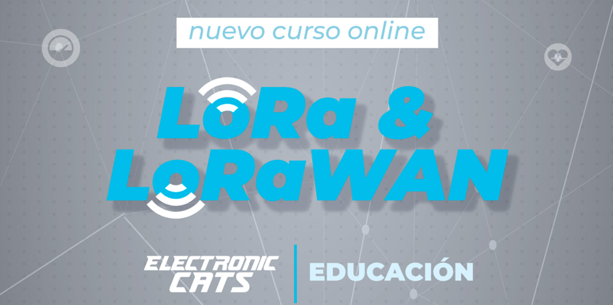

# Recursos de aprendizaje sobre LoRa/LoRaWAN e Internet de las Cosas en general
Este repositorio pretende listar todos aquellos recursos que vaya encontrando con los que aprender y estar al tanto sobre LoRa/LoRaWAN e Internet de las Cosas en general.

## LoRa / LoRaWAN

- [LoRaWAN Academy](https://lora-developers.semtech.com/learn/lorawan-academy): sin duda alguna, el curso más completo, gratuito (sólo necesitas crear una cuenta) y extenso que encontrarás sobre LoRa/LoRaWAN (creado por Semtech, la empresa que tiene la patente sobre la modulación LoRa®). Además, va mucho más allá, contando con módulos en los que aprender sobre parámetros de antenas, modulaciones, consumo de potencia, etc.

- [The Things Academy - LoRaWAN Fundamentals](https://www.udemy.com/course/lorawan-fundamentals/): curso básico sobre LoRa/LoRaWAN (creado por [The Things Network](https://www.thethingsnetwork.org/)) y con el que aprendarás a crear tus propias aplicaciones basadas en redes LPWAN, utilizando la red global The Things Network.

- [Curso Online - Protocolo de Comunicación LoRa y LoRaWAN](https://electroniccats.com/store/lora-y-lorawan): curso **en español** para conocer el protocolo de comunicación Lora y LoraWAN. Aprenderás desde los conceptos básicos hasta la realización de prácticas y un proyecto final que te ayudará a comprender mejor este interesante campo de comunicaciones. Se incluye un Kit que contiene la placa BastWAN.

