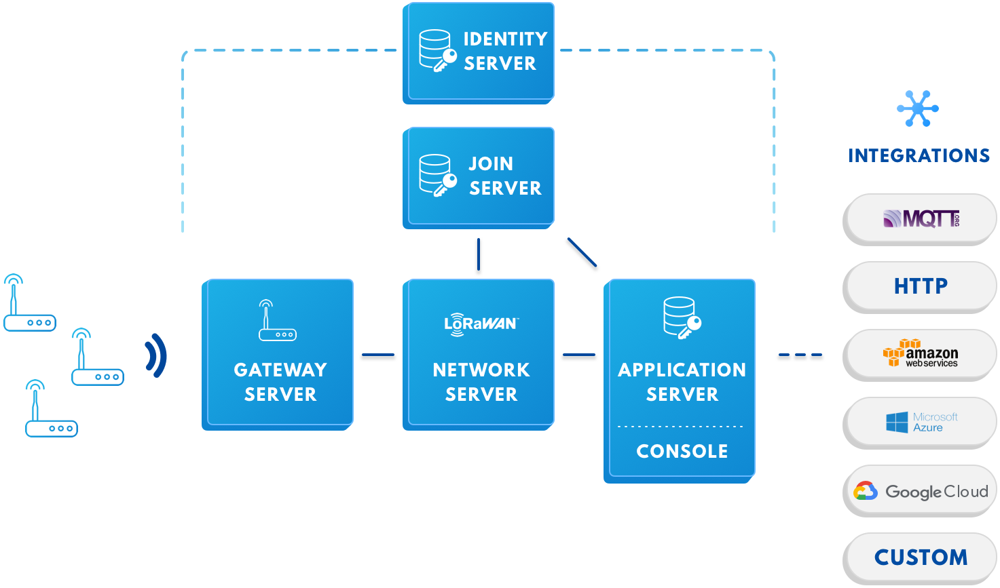

# The Things Stack

## Componentes

[Información](https://www.thethingsindustries.com/docs/reference/components/)

## Sporte LoRaWAN

Things Stack requiere que la versión LoRaWAN (MAC) y la versión de Parámetros Regionales (versión LoRaWAN PHY) se establezcan por dispositivo final. Estos valores predeterminados son la versión *MAC V1.0.2* de LoRaWAN y la versión *PHY V1.0.2 Rev B* de los parámetros regionales de LoRaWAN para los dispositivos finales importados de V2, porque esta configuración es la más utilizada.

## RX1 Delay

El retraso de *RX1* es el tiempo después del cual se abre la primera ventana de recepción (RX1). 
En la ventana de recepción, el servidor de red puede programar un enlace descendente. La segunda ventana de recepción (*RX2*) se abre exactamente *1 segundo después* de que se abre la primera. En LoRaWAN, el retraso de RX1 puede estar entre *1-15 segundos*.

Los dispositivos importados de V2 se configuran con un retraso de RX1 de 1 segundo. En todas las implementaciones de The Things Stack, el retraso de RX1 recomendado es de 5 segundos.

## Comandos MAC

Se espera que todos los dispositivos finales cumplan con la especificación LoRaWAN de forma predeterminada, lo que significa que los dispositivos finales deben responder a las solicitudes de comando MAC del servidor de red en consecuencia. Si un dispositivo no responde a un comando MAC de manera oportuna, puede haber interrupciones en el tráfico de enlace ascendente o descendente del dispositivo. Como se menciona en la especificación LoRaWAN, el servidor de red de The Things Stack siempre priorizará los comandos MAC sobre las cargas útiles de la aplicación en el enlace descendente.

En caso de que un dispositivo no cumpla completamente con la especificación LoRaWAN, aún puede funcionar en The Things Stack, pero puede requerir una configuración personalizada de MAC.

## DevStatusReq

El comando MAC `DevStatusReq` es enviado por el servidor de red periódicamente para comprobar el estado actual del dispositivo final. Se espera que los dispositivos envíen una `DevStatusAns` como respuesta.

Para los dispositivos finales que ignoran este comando MAC, asegúrate de configurar el `StatusTimePeriodicity`(tiempo de duración después del cual `DevStatusReq` es emitido por el servidor de red) y `StatusCountPeriodicity` (número de tramas después de los cuales `DevStatusReq` es emitido) del dispositivo explícitamente a `0`.

## Cobertura de puerta de enlace

[Packet Broker](https://www.thethingsindustries.com/docs/getting-started/packet-broker/) permite el intercambio de tráfico entre redes, por lo que el tráfico recibido por una red (The Things Network V2) pero destinado a una red diferente (The Things Stack) se puede reenviar hacia y desde esa red. Con Packet Broker habilitado tanto en The Things Stack como en The Things Network V2, puede recibir tráfico en The Things Stack sin tener que volver a configurar ninguna de sus puertas de enlace.

Packet Broker ya está habilitado en The Things Network V2 (red comunitaria pública) y The Things Stack Cloud.

## Datos de aplicación

Things Stack usa un formato de datos diferente para el tráfico de enlace ascendente y descendente que el V2.

Detalles del formato en [V2 (viejo)](https://www.thethingsnetwork.org/docs/applications/mqtt/api.html)
Detalles del formato en [V3 (nuevo)](https://www.thethingsindustries.com/docs/reference/data-formats/)

## Formatos de Payload o carga útil

V2 tiene soporte para decodificadores de carga útil, convertidores, validadores (para enlace ascendente) y codificadores (para enlace descendente). Pueden ser formato CayenneLPP o funciones Javascript.

Things Stack admite un formateador de carga útil de enlace ascendente (similar al decodificador de carga útil) y un formateador de carga útil de enlace descendente (similar al codificador de carga útil). Estos se pueden configurar por aplicación e incluso se pueden configurar por dispositivo final. El formato CayenneLPP y funciones Javascript todavía son compatibles, y ahora los formateadores de carga útil también se pueden obtener del repositorio de dispositivos.

## Integraciones

Leer toda la documentación dedicada a [integraciones](https://www.thethingsindustries.com/docs/integrations/) soportada por The Things Stack.

## MQTT

Things Stack tiene una nueva dirección de servidor MQTT, por lo que se debe cambiar esta dirección en la aplicación. También se necesita crear claves API y actualizar las credenciales MQTT.

[Información](https://www.thethingsindustries.com/docs/integrations/mqtt/)

## Webhooks

La integración HTTTP ahora se llama `Webhooks`. El formato de carga útil, los puntos finales del enlace descendente, las rutas y la configuración de seguridad han cambiado.

[Información](https://www.thethingsindustries.com/docs/integrations/webhooks/)

## Almacenamiento

The Things Stack admite una integración de almacenamiento similar a V2.

[Información](https://www.thethingsindustries.com/docs/integrations/storage/)

## API

[Información](https://www.thethingsindustries.com/docs/reference/api/)